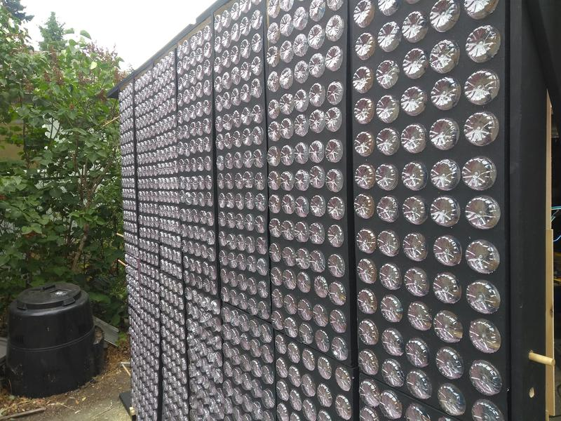
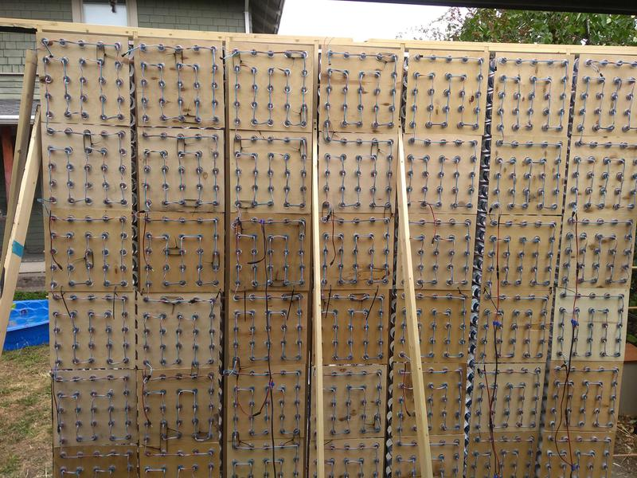

## Goals:
* Create a Rust Udp client that can communitcate with the existing Flaschen Taschen Server.

* Ability to take images, rescale, and format so that server can inpterpret.

* Include functionality for Xbox Kinect as a data source.
* Allow the rgb and depth sensor functionality in the application.
* Allow user to adjust the the motor from the Xbox Kinect, to adjust the angle of the camera.
---

# Flachen Taschen Rust client with Xbox Kinect functionality

This project will be using the flaschen taschen protocal that is is provided by [hzeller](https://github.com/hzeller/flaschen-taschen/blob/master/doc/protocols.md)  to create a rust client. The needs to flaschen taschen server "Receives UDP packets with a raw PPM file (P6) on port 1337 in a single datagram per image. A ppm file has a simple text header followed by the binary RGB image data."

As for the header that it referes: 

```P6     # Magic number
10 10  # width height (decimal, number in ASCII)
#FT: 5 8 13
255    # values per color (fixed). After newline, 10 * 10 * 3 bytes RGB data follow
```

Where the comment #FT is that the server uses to interpret the x,y, and z offest of the image for the display. 

## Must have equipment:
* Xbox kinect V1

## Optional 
* Flaschen Taschen LED Display

## Instructions 
* One must clone and download the [flaschen taschen](https://github.com/hzeller/flaschen-taschen.git) project.
* Follow the [instructions](https://github.com/hzeller/flaschen-taschen/blob/master/server/README.md) to set up the server aspect of the project. If you do not have an led display follow the instructions to run in your terminal.
* Install the [OpenKinect/libfreenect](https://github.com/OpenKinect/libfreenect.git) dependencies on your computer. So that the wrappers for the rust crate work correctly on your computer. If working on a mac, you can brew install the dependencies.
* clone this repo and go into the main folder
* Plug in your Kinect
* Set your server name in ```etc/hosts``` if using anything other than localhost
* Start the server from the flaschen taschen project on the other device or on the same computer. NOTE: Both devices must be connected on the same Wireless connection. [Server Directions](https://github.com/hzeller/flaschen-taschen/tree/master/server) and take note of the dimensions of the screen size.
* In The flasch.rs file change the constant IP to your computers IP, or statically set your IP address to ```192.168.0.104```
* Run the program from this project ```cargo run --features "<feature>" <host name> <width> <height <z index>``` if no feature is presented you will get a prompt to enter one in, and same for not enough arguements. 
	Features available:
		* rgb - Use the rgb camera on the kinect
		* depth - Use the depth sensor on the kinect
		* (rgb or depth) window	- display the data on your computer using an openGl window

## Additional Functions
* In the terminal window hit w(up), and s(down) followed by Enter to adjust the camera angle
* To cleanly terminate the application hit q followed by Enter 


## Flaschen Tashen Display Pictures
Front Display of Screen:


Back Display of Screen: 


_Thanks to my housemate Dan Wright Who built the display and took photos of the display._

### Inspiration
* [flaschen taschen project](https://github.com/hzeller/flaschen-taschen.git)
* [libfreenectrs](https://github.com/Entscheider/freenect-rs.git)